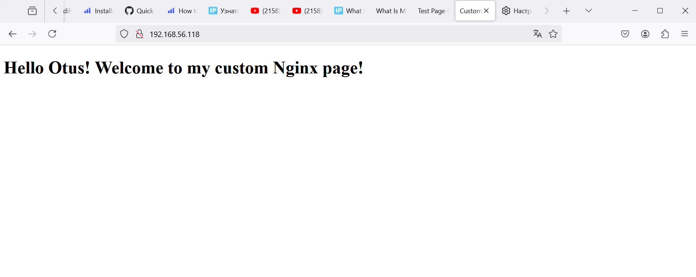

# Docker

## Цель домашнего задания  
Разобраться с основами docker, с образом, эко системой docker в целом.

### Описание домашнего задания  

1. Установите Docker на хост машину
https://docs.docker.com/engine/install/ubuntu/;   
2. Установите Docker Compose - как плагин, или как отдельное приложение;   
3. Создайте свой кастомный образ nginx на базе alpine. После запуска nginx должен отдавать кастомную страницу (достаточно изменить дефолтную страницу nginx);   
4. Определите разницу между контейнером и образом;   
5. Вывод опишите в домашнем задании;   
6. Ответьте на вопрос: Можно ли в контейнере собрать ядро?.   
#### Собранный образ необходимо запушить в docker hub и дать ссылку на ваш репозиторий.   

### Команды для выполнения ДЗ:   

*docker ps* - просмотреть список запущенных контейнеров;   
*docker ps -a* - просмотреть список всех контейнеров;   
*docker run -d -p port:port container_name* - запуск нового контейнера с пробросом портов;   
*docker stop container_name* - остановка контейнера;   
*docker logs container_name* - вывод логов контейнеров;   
*docker inspect container_name* - информация по запущенному контейнеру;   
*docker build -t dockerhub_login/reponame:ver* - билд нового образа;   
*docker push/pull* - отправка/получение образа из docker-registry;   
*docker exec -it container_name bash* - выполнить команду внутри оболочки контейнера (в данном примере мы выполняем команду “bash” внутри контейнера и попадаем в оболочку, внутрь контейнера).   


#### Шаблон для работы с Dockerfile   
Что должно быть Dockerfile:   

FROM image name   
RUN apt update -y && apt upgrade -y   
COPY или ADD filename /path/in/image   
EXPOSE portopenning   
CMD or ENTRYPOINT or both   

#### # не забываем про разницу между COPY и ADD
#### # or - одна из опций на выбор

#### Критерии оценивания   
1. Создан свой кастомный образ nginx на базе alpine. После запуска nginx должен отдавать кастомную страницу (достаточно изменить дефолтную страницу nginx).
2. Определена разница между контейнером и образом, написан вывод.
3. Написан ответ на вопрос: Можно ли в контейнере собрать ядро?
4. Собранный образ запушин в docker hub и дана ссылку на репозиторий.   

#### Задание со звездочкой*   
1. Написать Docker-compose для приложения Redmine, с использованием опции build.
2. Добавить в базовый образ redmine любую кастомную тему оформления.
3. Убедиться что после сборки новая тема доступна в настройках.
4. Настроить вольюмы, для сохранения всей необходимой информации.   


Как установить тему для Redmine 
https://www.redmine.org/projects/redmine/wiki/themes   

Пример темы для Redmine   
https://github.com/farend/redmine_theme_farend_bleuclair#demo


# Выполнение:  

# 1. Создаю Dockerfile  в рабочей директории /home/user/docker

```dockerfile

FROM alpine:latest

RUN apk update && apk add nginx

RUN mkdir -p /var/lib/nginx/html

COPY index.html /var/lib/nginx/html/index.html

COPY nginx.conf /etc/nginx/nginx.conf

EXPOSE 80

CMD ["nginx", "-g", "daemon off;"]

```

# 1.1. Создаю кастомную страницу и конфигурационный файл nginx.conf. Все это копирую в рабучую директорию   

index.html   

```html

<!DOCTYPE html>
<html>
<head>
    <title>Custom Nginx Page</title>
</head>
<body>
    <h1>Hello Otus! Welcome to my custom Nginx page!</h1>
</body>
</html>

```   

nginx.conf   

```config

events { }

http {
    server {
        listen 80;
        server_name localhost;

        location / {
            root /var/lib/nginx/html;
            index index.html;
        }
    }
}

```

# 1.2. Сборка образа   

*Далее действия выполняю от имени пользователя root*

```shell  

root@ubuntu:/home/guared/docker# docker build -t custom-nginx .
[+] Building 11.4s (10/10) FINISHED                                                                                       docker:default
 => [internal] load build definition from Dockerfile                                                                                0.8s
 => => transferring dockerfile: 726B                                                                                                0.2s
 => [internal] load metadata for docker.io/library/alpine:latest                                                                    1.3s
 => [internal] load .dockerignore                                                                                                   0.4s
 => => transferring context: 2B                                                                                                     0.0s
 => [1/5] FROM docker.io/library/alpine:latest@sha256:56fa17d2a7e7f168a043a2712e63aed1f8543aeafdcee47c58dcffe38ed51099              0.0s
 => [internal] load build context                                                                                                   0.7s
 => => transferring context: 263B                                                                                                   0.1s
 => CACHED [2/5] RUN apk update && apk add nginx                                                                                    0.0s
 => CACHED [3/5] RUN mkdir -p /var/lib/nginx/html                                                                                   0.0s
 => CACHED [4/5] COPY index.html /var/lib/nginx/html/index.html                                                                     0.0s
 => [5/5] COPY nginx.conf /etc/nginx/nginx.conf                                                                                     2.1s
 => exporting to image                                                                                                              2.4s
 => => exporting layers                                                                                                             1.3s
 => => writing image sha256:b4b3396093b8281467f6cde89531120dd3931c3f1f4c4bfd97a842cadf018d51                                        0.2s
 => => naming to docker.io/library/custom-nginx


```
# 1.3. Запуск контейнера на основе созданного образа   

```shell  

root@ubuntu:/home/guared/docker# docker run -d -p 80:80 custom-nginx
f0eb7ca72b647a61c0593c06c7be04ac546c971c065da2a5a87ae7d831c4c0dc

```

# 1.4. Убедился что контейнер запущен   

```shell  

root@ubuntu:/home/guared/docker# docker ps
CONTAINER ID   IMAGE          COMMAND                  CREATED          STATUS          PORTS                               NAMES
f0eb7ca72b64   custom-nginx   "nginx -g 'daemon of…"   51 minutes ago   Up 51 minutes   0.0.0.0:80->80/tcp, :::80->80/tcp   competent_cori

```

# 1.5. Проверил в браузере по адресу http://192.168.56.118/, что Nginx предоставляет кастомную страницу   

   


# 2. Определение разницы между контейнером и образом, написать вывод.   

- Образ (Docker Image)
Образ Docker — представляет собой исполняемый пакет, содержащий все необходимое для запуска приложения: код, среду выполнения, библиотеки, переменные окружения и файлы конфигурации;   
Статичность: Образ является неизменным (immutable). После его создания содержимое образа не изменяется.   
Создание: Образы создаются на основе Dockerfile, который содержит последовательность инструкций для сборки образа. Также образы могут быть загружены из Docker Hub или других реестров Docker.   
Хранение: Образы хранятся в Docker Registry (например, Docker Hub) и могут быть использованы для создания контейнеров.

- Контейнер (Docker-Container)
Контейнер Docker это формат пакетирования, который позволяет упаковать весь код и зависимости приложения в стандартный формат, чтобы приложение могло быстро и надежно запускаться в разных вычислительных средах.   
Динамичность: Контейнеры изменяемы. Можно запускать процессы внутри контейнера, изменять файлы и сохранять данные во время его работы.   
Изоляция: Контейнеры изолированы друг от друга и от хостовой системы. Они имеют собственные файловые системы, сети и процессы, что позволяет запускать несколько контейнеров на одном хосте без конфликтов.   
Жизненный цикл: Контейнеры могут быть запущены, остановлены, перезапущены и удалены. Изменения, сделанные внутри контейнера, исчезают после его удаления, если они не сохранены в виде нового образа.   

```shell  

root@ubuntu:/home/guared/docker# docker commit f0eb7ca72b64 custom-nginx:v1.0
sha256:2dfc825325480863cdd5f6fd4b42fb217bcefdd8584caafae2599483df147747

```

- Вывод
Образ Docker — это неизменяемый шаблон, который используется для создания контейнеров. Контейнер, в свою очередь, является изолированным экземпляром, созданным на основе образа и может быть изменен во время работы. Образы хранятся в реестре и используются для запуска контейнеров, что обеспечивает изоляцию и масштабируемость приложений.   


# 3. Ответ на вопрос: Можно ли в контейнере собрать ядро?   

Да, можно собрать ядро Linux внутри контейнера Docker. Однако, для этого контейнеру потребуются определенные привилегии и доступ к ресурсам хостовой системы.   

*На просторах сети Интернет, нашел пример:*   

#### 3.1. Создание Dockerfile:
Создайте Dockerfile, который установит все необходимые зависимости для сборки ядра.
Dockerfile:   

```dockerfile

# Использовать базовый образ с необходимыми инструментами
FROM ubuntu:20.04

# Обновляет пакеты и устанавливает зависимости
RUN apt-get update && apt-get install -y \
    build-essential \
    libncurses-dev \
    bison \
    flex \
    libssl-dev \
    libelf-dev \
    wget

# Создает рабочую директорию
WORKDIR /usr/src

# Скачивает исходный код ядра
RUN wget https://cdn.kernel.org/pub/linux/kernel/v5.x/linux-5.10.tar.xz && \
    tar -xf linux-5.10.tar.xz

# Устанавливает рабочую директорию на исходный код ядра
WORKDIR /usr/src/linux-5.10

# Определяет команду по умолчанию для сборки ядра
CMD ["make", "-j$(nproc)"]

```


# __Важно!__   
Контейнер должен быть запущен с привилегиями (--privileged), чтобы получить доступ к устройствам и ресурсам, необходимым для сборки ядра.   
Собранное ядро можно скопировать из контейнера на хостовую систему для дальнейшего использования.   
Таким образом, можно собрать ядро Linux внутри контейнера Docker.   


# 4. Далее выполнил публикацию образа в dockerhub    

```shell  

root@ubuntu:/home/guared/docker# docker login
....
Login Succeeded
root@ubuntu:/home/guared/docker# docker tag custom-nginx guared/custom-nginx:latest   # Затегировал образ   
root@ubuntu:/home/guared/docker# docker push guared/custom-nginx:latest   # Опубликовал образ   
The push refers to repository [docker.io/guared/custom-nginx]
d0b5781f31c6: Pushed
4a6d530b690f: Pushed
a93446aeb816: Pushed
8ed45c219328: Pushed
a0904247e36a: Mounted from library/alpine
latest: digest: sha256:546569274f270348eb0d6ec85a7abe4d771ce89667665b2d567f20cc628960e4 size: 1359

```
#### Ссылка на репозиторий   

https://hub.docker.com/r/guared/custom-nginx

______________   
end
